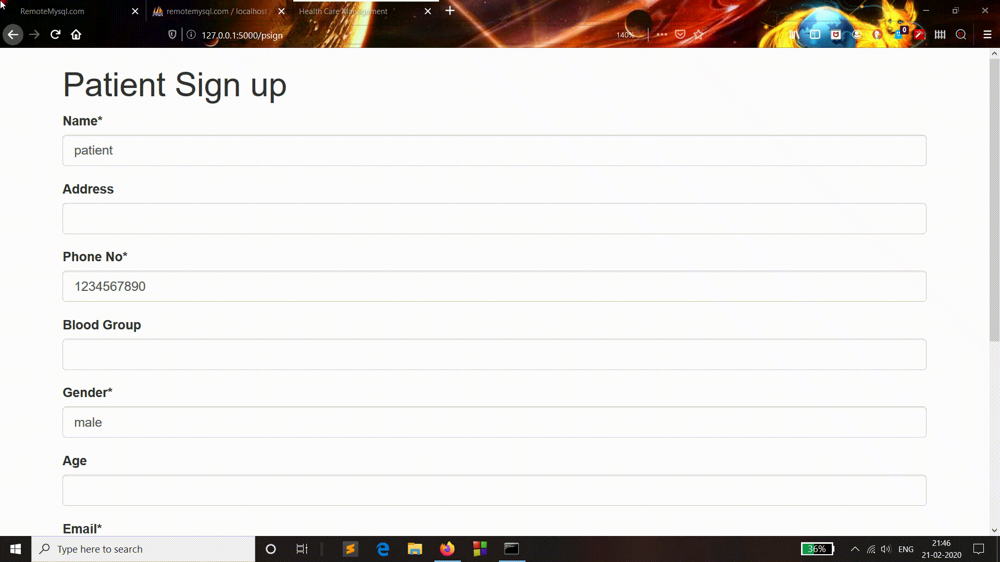
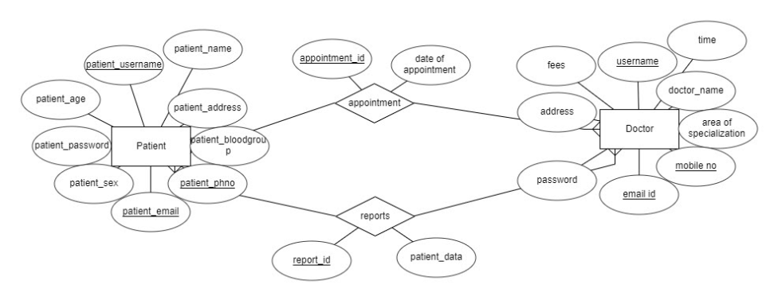

# HealthcareManagement

This is a Healthcare Online Management Database Project consisting of 2 modules, viz. - Patient, and Doctor module.

### Patient module:  
Patients can register , login, change password, view his/her profile, Appointments and Book Appointment after checking the doctor's details. 
Sign up and login has been shown below.

##### Book Appointment: 
In this section, Patient can book his/her appointment. 

##### Reports:
Patients can check their reports as uploaded by the respective doctor.

### Doctor module: 
Doctor can register, login same as shown in the patient module, change password, view his/her own profile and online appointments made to them. 
##### Appointment: 
In this section, doctors can check their appointments fixed by patients.
##### Submit Report:
In this section, the doctor can manage patients via uploading their reports as per the patients' ID. 

Dependencies of these two modules are shown below:

#### _Programming language used in the project are :_
1. HTML 5
2. Python/Flask
3. CSS 3

#### _Packages to install:_
* flask
* flask_mysqldb 
* wtforms 
* functools 
* flask_mail 
